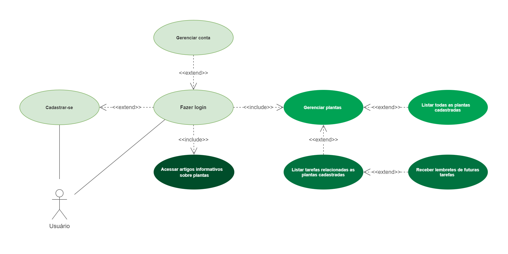
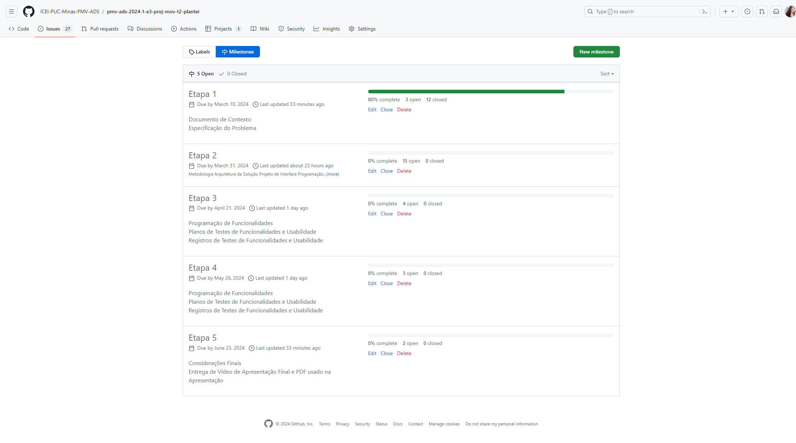
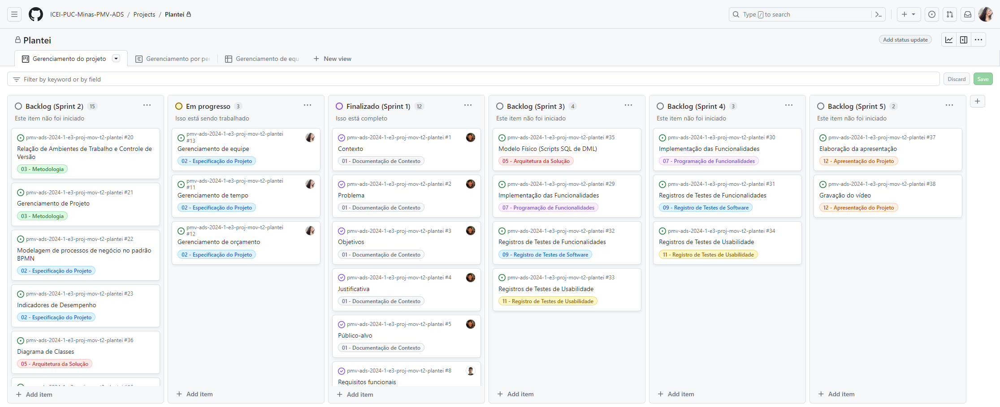
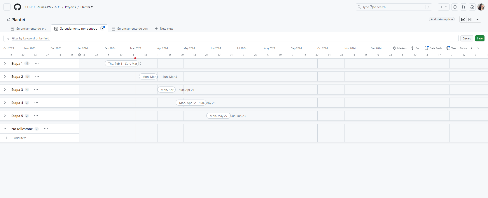
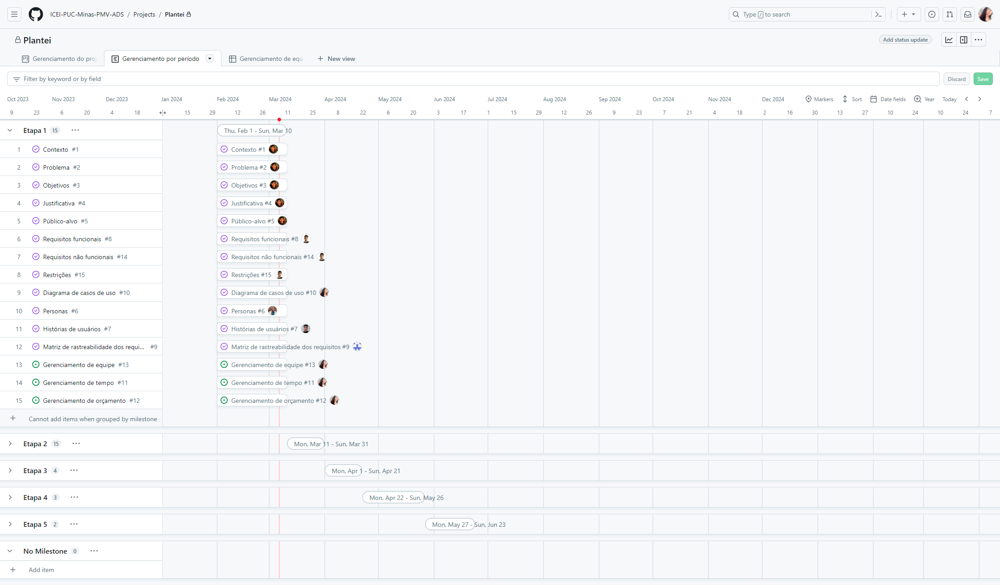
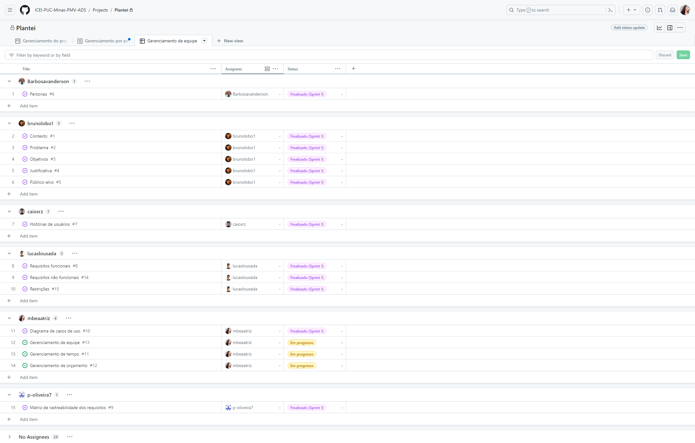

# Especificações do Projeto

Pré-requisitos: <a href="1-Documentação de Contexto.md"> Documentação de Contexto</a>

Definição do problema e ideia de solução a partir da perspectiva do usuário. É composta pela definição do  diagrama de personas, histórias de usuários, requisitos funcionais e não funcionais além das restrições do projeto.

Apresente uma visão geral do que será abordado nesta parte do documento, enumerando as técnicas e/ou ferramentas utilizadas para realizar a especificações do projeto

## Personas

## Histórias de Usuários

Com base na análise das personas forma identificadas as seguintes histórias de usuários:

|EU COMO... `PERSONA`| QUERO/PRECISO ... `FUNCIONALIDADE` |PARA ... `MOTIVO/VALOR`                 |
|--------------------|------------------------------------|----------------------------------------|
|usuário iniciante  | criar um perfil para minha planta    | receber orientações personalizadas sobre seus cuidados       |
|usuário avançado    | adicionar múltiplas plantas ao meu perfil      | gerenciar eficientemente o cuidado de todas as minhas plantas em um só lugar |
|usuário   | receber notificações personalizadas sobre o momento ideal para regar minha planta       | garantir que ela receba a quantidade adequada de água para prosperar      |
|usuário ocupado     | ajustar as configurações de lembretes    |adaptar o cuidado das plantas à minha rotina movimentada      |
|usuário curioso   |acessar dicas e tutoriais sobre o cuidado de plantas      |aprimorar minhas habilidades de jardinagem e entender as necessidades específicas de cada planta      |
|usuário preocupado com a privacidade    |controlar quem pode acessar minhas informações de planta     |garantir a confidencialidade dos dados relacionados às minhas plantas      |
|usuário experiente    |fornecer feedback sobre o estado da minha planta     |receber sugestões adicionais de cuidados e melhorias      |
|usuário consciente da água |informações sobre práticas de economia de água no cuidado das plantas |contribuir para a conservação de recursos hídricos |

Apresente aqui as histórias de usuário que são relevantes para o projeto de sua solução. As Histórias de Usuário consistem em uma ferramenta poderosa para a compreensão e elicitação dos requisitos funcionais e não funcionais da sua aplicação. Se possível, agrupe as histórias de usuário por contexto, para facilitar consultas recorrentes à essa parte do documento.

> **Links Úteis**:
> - [Histórias de usuários com exemplos e template](https://www.atlassian.com/br/agile/project-management/user-stories)
> - [Como escrever boas histórias de usuário (User Stories)](https://medium.com/vertice/como-escrever-boas-users-stories-hist%C3%B3rias-de-usu%C3%A1rios-b29c75043fac)
> - [User Stories: requisitos que humanos entendem](https://www.luiztools.com.br/post/user-stories-descricao-de-requisitos-que-humanos-entendem/)
> - [Histórias de Usuários: mais exemplos](https://www.reqview.com/doc/user-stories-example.html)
> - [9 Common User Story Mistakes](https://airfocus.com/blog/user-story-mistakes/)

## Modelagem do Processo de Negócio 

### Análise da Situação Atual

Apresente aqui os problemas existentes que viabilizam sua proposta. Apresente o modelo do sistema como ele funciona hoje. Caso sua proposta seja inovadora e não existam processos claramente definidos, apresente como as tarefas que o seu sistema pretende implementar são executadas atualmente, mesmo que não se utilize tecnologia computacional. 

### Descrição Geral da Proposta

Apresente aqui uma descrição da sua proposta abordando seus limites e suas ligações com as estratégias e objetivos do negócio. Apresente aqui as oportunidades de melhorias.

### Processo 1 – NOME DO PROCESSO

Apresente aqui o nome e as oportunidades de melhorias para o processo 1. Em seguida, apresente o modelo do processo 1, descrito no padrão BPMN. 

### Processo 2 – NOME DO PROCESSO

Apresente aqui o nome e as oportunidades de melhorias para o processo 2. Em seguida, apresente o modelo do processo 2, descrito no padrão BPMN.

## Indicadores de Desempenho

Apresente aqui os principais indicadores de desempenho e algumas metas para o processo. Atenção: as informações necessárias para gerar os indicadores devem estar contempladas no diagrama de classe. Colocar no mínimo 5 indicadores. 

Usar o seguinte modelo: 

Obs.: todas as informações para gerar os indicadores devem estar no diagrama de classe a ser apresentado a posteriori. 

## Requisitos

As tabelas que se seguem apresentam os requisitos funcionais e não funcionais que detalham o escopo do projeto.

### Requisitos Funcionais

|ID    | Descrição do Requisito  | Prioridade |
|------|-----------------------------------------|----|
|RF-001| A aplicação deve permitir que o usuário se cadastre, faça login, edite seu email e senha, e apague sua conta. | ALTA | 
|RF-002| A aplicação deve permitir que o usuário adicione, edite e remova plantas. | ALTA |
|RF-003| A aplicação deve exibir informações gerais sobre a planta pesquisada, incluindo: nome, exposição ao sol recomendada, frequência de rega ideal, tempo recomendado para nova fertilização e outras informações pertinentes. | MÉDIA |
|RF-004| A aplicação deve disponibilizar para o usuário o recebimento de notificações sobre as seguintes tarefas relacionadas às suas plantas: regar, fertilizar e trocar o vaso. | ALTA |
|RF-005| A aplicação deve exibir todas as plantas adicionadas pelo usuário. | ALTA |
|RF-006| A aplicação deve exibir todas as futuras tarefas de cada planta adicionada pelo usuário. | ALTA |
|RF-007| A aplicação deve disponibilizar artigos variados sobre plantas. | BAIXA |

### Requisitos não Funcionais

|ID     | Descrição do Requisito  |Prioridade |
|-------|-------------------------|----|
|RNF-001| O sistema deve ser suportado em dispositivos iOS e Android | ALTA |
|RNF-002| O sistema deve ser responsivo para rodar em diferentes dispositivos móveis | MÉDIA |
|RNF-003| O sistema deve cumprir com a Lei Geral de Proteção de Dados (LGPD) | ALTA |
|RNF-004| O sistema deve atender aos critérios de acessibilidade | ALTA |
|RNF-005| O sistema deverá usar a tecnologia React Native em seu desenvolvimento | ALTA |
|RNF-006| O sistema deverá conter uma ampla base de dados sobre plantas | ALTA |
|RNF-007| O sistema deve possuir uma interface intuitiva e amigável para usuários de todas as idades e níveis de habilidade. | MÉDIA |

<!-- Com base nas Histórias de Usuário, enumere os requisitos da sua solução. Classifique esses requisitos em dois grupos:

- [Requisitos Funcionais
 (RF)](https://pt.wikipedia.org/wiki/Requisito_funcional):
 correspondem a uma funcionalidade que deve estar presente na
  plataforma (ex: cadastro de usuário).
- [Requisitos Não Funcionais
  (RNF)](https://pt.wikipedia.org/wiki/Requisito_n%C3%A3o_funcional):
  correspondem a uma característica técnica, seja de usabilidade,
  desempenho, confiabilidade, segurança ou outro (ex: suporte a
  dispositivos iOS e Android).
Lembre-se que cada requisito deve corresponder à uma e somente uma
característica alvo da sua solução. Além disso, certifique-se de que
todos os aspectos capturados nas Histórias de Usuário foram cobertos. -->

## Restrições

O projeto está restrito pelos itens apresentados na tabela a seguir.

|ID| Restrição                                             |
|--|-------------------------------------------------------|
|RE-001 | Não é permitido à equipe terceirizar o desenvolvimento do trabalho. |
|RE-002 | O projeto será entregue em cinco fases progressivas ao longo do semestre letivo, com marcos definidos para cada entrega parcial. |
|RE-003 | O projeto completo deverá ser entregue no final do semestre letivo. |

<!-- Enumere as restrições à sua solução. Lembre-se de que as restrições geralmente limitam a solução candidata.

> **Links Úteis**:
> - [O que são Requisitos Funcionais e Requisitos Não Funcionais?](https://codificar.com.br/requisitos-funcionais-nao-funcionais/)
> - [O que são requisitos funcionais e requisitos não funcionais?](https://analisederequisitos.com.br/requisitos-funcionais-e-requisitos-nao-funcionais-o-que-sao/) -->

## Diagrama de Casos de Uso

| ID     | Caso de uso  | Descrição | Requisito associado |
|-------|----|-------------------------|----|
|UC-001| Cadastrar-se | O usuário deve se cadastrar para utilizar o aplicativo. | RF-001 |
|UC-002| Fazer login | Ao se cadastrar, o usuário poderá fazer o login para utilizar o aplicativo. | RF-001 |
|UC-003| Gerenciar conta | Ao fazer login, o usuário poderá: editar seu email, sua senha e excluir sua conta. | RF-001 |
|UC-004| Gerenciar plantas | Ao fazer login, o usuário poderá: adicionar, editar, visualizar detalhes e excluir plantas. | RF-002 RF-003 |
|UC-005| Listar todas as plantas cadastradas | Quando o usuário possuir uma ou mais plantas cadastradas, poderá ser exibida uma lista delas. | RF-005 |
|UC-006| Listar tarefas relacionadas as plantas cadastradas | O usuário poderá visualizar uma lista com as futuras tarefas relacionadas às suas plantas cadastradas, sendo elas: regar, fertilizar e trocar o vaso. | RF-006 |
|UC-007| Receber lembretes de futuras tarefas | O usuário poderá ativar os lembretes, para que seja lembrado periodicamente sobre as tarefas relacionadas às suas plantas. | RF-004 |
|UC-008| Acessar artigos informativos sobre plantas | Ao fazer login, o usuário poderá acessar artigos informativos sobre plantas. | RF-007 |

## Matriz de Rastreabilidade

|  ID   | RF-001 | RF-002 | RF-003 | RF-004 | RF-005 | RF-006 | RF-007 | RNF-001 | RNF-002 | RNF-003 | RNF-004 | RNF-005 | RNF-006 | RNF-007 | UC-001 | UC-002 | UC-003 | UC-004 | UC-005 | UC-006 | UC-007 | UC-008 |
|-------|--------|--------|--------|--------|--------|--------|--------|---------|---------|---------|---------|---------|---------|---------|--------|--------|--------|--------|--------|--------|--------|--------|
|RF-001 |   -    |        |        |        |        |        |        |    X    |    X    |    X    |         |         |         |    X    |   X    |   X    |   X    |        |        |        |        |        |
|RF-002 |        |   -    |   X    |   X    |   X    |   X    |        |    X    |    X    |         |         |         |    X    |    X    |        |        |        |   X    |        |        |        |        |
|RF-003 |        |   X    |   -    |        |   X    |        |        |         |         |         |         |         |    X    |         |        |        |        |   X    |        |        |        |        |
|RF-004 |        |   X    |        |   -    |   X    |   X    |        |    X    |    X    |         |         |         |    X    |    X    |        |        |        |        |        |   X    |   X    |        |
|RF-005 |        |   X    |   X    |   X    |   -    |   X    |        |    X    |    X    |         |         |         |    X    |    X    |        |        |        |   X    |   X    |        |        |        |
|RF-006 |        |   X    |        |   X    |   X    |   -    |        |    X    |    X    |         |         |         |    X    |    X    |        |        |        |        |        |   X    |   X    |   X    |
|RF-007 |        |        |        |        |        |        |   -    |         |         |         |         |         |         |         |        |        |        |        |        |        |        |   X    |
|RNF-001|   X    |   X    |        |   X    |   X    |   X    |        |    -    |    X    |    X    |    X    |    X    |    X    |    X    |   X    |   X    |   X    |   X    |   X    |   X    |   X    |   X    |
|RNF-002|   X    |   X    |        |   X    |   X    |   X    |        |    X    |    -    |         |    X    |    X    |    X    |    X    |   X    |   X    |   X    |   X    |   X    |   X    |   X    |   X    |
|RNF-003|   X    |        |        |        |        |        |        |    X    |         |    -    |         |         |         |         |   X    |   X    |   X    |        |        |        |        |        |
|RNF-004|        |        |        |        |        |        |        |    X    |    X    |         |    -    |         |         |    X    |   X    |   X    |   X    |   X    |   X    |   X    |   X    |   X    |
|RNF-005|        |        |        |        |        |        |        |    X    |    X    |         |         |    -    |         |         |   X    |   X    |   X    |   X    |   X    |   X    |   X    |   X    |
|RNF-006|        |   X    |   X    |        |   X    |        |        |    X    |    X    |         |         |         |    -    |         |        |        |        |   X    |   X    |        |        |   X    |
|RNF-007|   X    |   X    |        |   X    |   X    |   X    |        |    X    |    X    |         |    X    |         |         |    -    |   X    |   X    |   X    |   X    |   X    |   X    |   X    |   X    |
|UC-001 |   X    |        |        |        |        |        |        |    X    |    X    |    X    |    X    |    X    |         |    X    |   -    |   X    |   X    |        |        |        |        |        |
|UC-002 |   X    |        |        |        |        |        |        |    X    |    X    |    X    |    X    |    X    |         |    X    |   X    |   -    |   X    |        |        |        |        |        |
|UC-003 |   X    |        |        |        |        |        |        |    X    |    X    |    X    |    X    |    X    |         |    X    |   X    |   X    |   -    |        |        |        |        |        |
|UC-004 |        |   X    |   X    |   X    |   X    |   X    |        |    X    |    X    |         |    X    |    X    |    X    |    X    |        |        |        |   -    |   X    |   X    |   X    |   X    |
|UC-005 |        |   X    |   X    |   X    |   X    |   X    |        |    X    |    X    |         |    X    |    X    |    X    |    X    |        |        |        |   X    |   -    |   X    |   X    |   X    |
|UC-006 |        |   X    |        |   X    |   X    |   X    |        |    X    |    X    |         |    X    |    X    |    X    |    X    |        |        |        |   X    |   X    |   -    |   X    |        |
|UC-007 |        |   X    |        |   X    |   X    |   X    |        |    X    |    X    |         |    X    |    X    |    X    |    X    |        |        |        |   X    |   X    |   X    |   -    |        |
|UC-008 |        |        |        |        |        |   X    |   X    |    X    |    X    |         |    X    |    X    |    X    |    X    |        |        |        |   X    |   X    |        |        |   -    |

# Gerenciamento de Projeto

O gerenciamento do projeto será realizado utilizando as ferramentas do GitHub.

## Gerenciamento de Tempo

A equipe fará o gerenciamento do tempo a partir de "Issues" e "Milestones". Para esse projeto, cada "Issue" representa uma tarefa específica e bem definida, facilitando a compreensão e o acompanhamento individual do progresso. As "Milestones", que servem como marcos do projeto, irão representar as "Etapas", acompanhando as datas e especifícações disponibilizadas no Canvas. Para acompanhar as Issues e Milestones, [clique aqui](https://github.com/ICEI-PUC-Minas-PMV-ADS/pmv-ads-2024-1-e3-proj-mov-t2-plantei/milestones?direction=asc&sort=title&state=open).

Utilizando o recurso "Projects" foi feita a organização das tarefas em Backlogs específicos para cada Sprint, proporcionando clareza e visibilidade do progresso do projeto. Os Backlogs de cada etapa foram iniciados e terão incrementos ao longo do projeto. Para acessar o painel [clique aqui](https://github.com/orgs/ICEI-PUC-Minas-PMV-ADS/projects/783/views/1).

.

Para melhor visualização do período em que cada etapa e tarefa deve ser entregue, foi feito um roadmap baseado no diagrama de Gantt. Para ter acesso ao roadmap completo [clique aqui](https://github.com/orgs/ICEI-PUC-Minas-PMV-ADS/projects/783/views/7).
.

## Gerenciamento de Equipe

O gerenciamento adequado de tarefas contribuirá para que o projeto alcance altos níveis de produtividade. Por isso, é fundamental que ocorra a gestão de tarefas e de pessoas, de modo que os times envolvidos no projeto possam ser facilmente gerenciados. 

O painel criado para esse projeto oferece uma visão completa de todos os membros da equipe e suas tarefas, facilitando o acompanhamento do progresso individual e do projeto como um todo. Para acessar o painel completo [clique aqui](https://github.com/orgs/ICEI-PUC-Minas-PMV-ADS/projects/783/views/8).
.

## Gestão de Orçamento

O processo de determinar o orçamento do projeto é uma tarefa que depende, além dos produtos (saídas) dos processos anteriores do gerenciamento de custos, também de produtos oferecidos por outros processos de gerenciamento, como o escopo e o tempo.

