# Projeto de Interface

<!-- Pré-requisitos: <a href="2-Especificação do Projeto.md"> Documentação de Especificação</a> -->

Visão geral da interação do usuário pelas telas do sistema e protótipo interativo das telas com as funcionalidades que fazem parte do sistema (wireframes).

<!-- Apresente as principais interfaces da plataforma. Discuta como ela foi elaborada de forma a atender os requisitos funcionais, não funcionais e histórias de usuário abordados nas <a href="2-Especificação do Projeto.md"> Documentação de Especificação</a>. -->

## Diagrama de Fluxo

O Diagrama de Fluxo apresenta um modelo que ilustra como o usuário pode navegar pelo sistema por meio das telas, seguindo o planejamento da aplicação, em conformidade com os requisitos funcionais, não funcionais, restrições e histórias das personas.

| 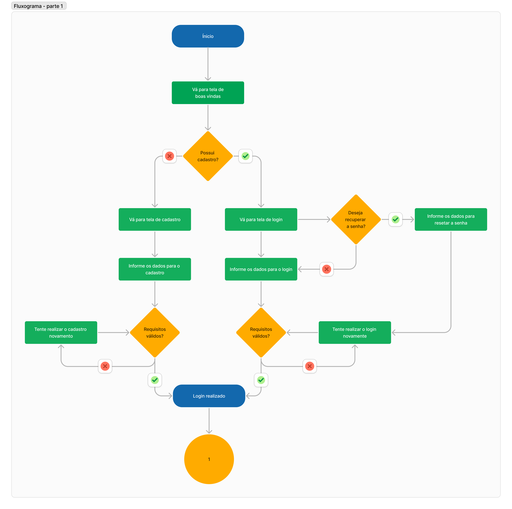 |
| :---------------------------------------------------------------------------------------: |
|                      *Figura 1 - Parte 1 do Fluxo do usuário*                      |

| 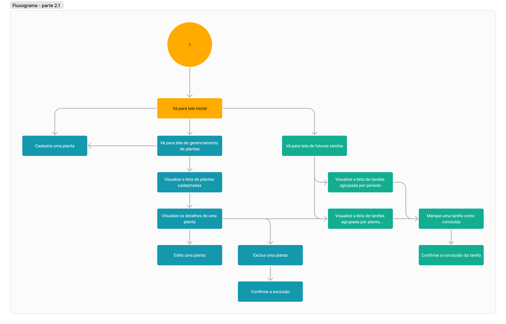 |
| :-------------------------------------------------------------------------------------: |
|                      *Figura 2 - Parte 2.1 do Fluxo do usuário*                      |

| 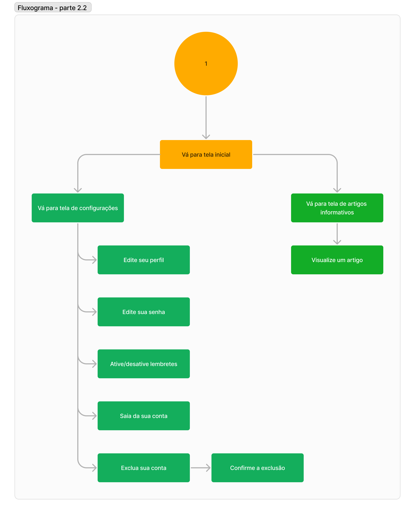 |
| :-------------------------------------------------------------------------------------: |
|                      *Figura 3 - Parte 2.2 do Fluxo do usuário*                      |

<!-- As referências abaixo irão auxiliá-lo na geração do artefato “Diagramas de Fluxo”.

> **Links Úteis**:
> - [Fluxograma online: seis sites para fazer gráfico sem instalar nada | Produtividade | TechTudo](https://www.techtudo.com.br/listas/2019/03/fluxograma-online-seis-sites-para-fazer-grafico-sem-instalar-nada.ghtml) -->

## Wireframes

Os wireframes foram desenvolvidos utilizando o Figma. Para ter acesso a todas as telas do aplicativo, [clique aqui](https://figma.com/file/Bi6PZWAjAFd13eNVsdBe6k/plantei?type=design&node-id=105%3A2843&mode=design&t=SHOgVTdepgb96Mw1-1).
Para acessar o wireframe de forma interativa [clique aqui](https://figma.com/proto/Bi6PZWAjAFd13eNVsdBe6k/plantei?type=design&node-id=172-464&t=SHOgVTdepgb96Mw1-0&scaling=min-zoom&page-id=105%3A2843).

### Fluxo com as Telas do App
Este guia visual ilustra o fluxo de navegação do aplicativo, detalhando os principais passos em cada tela para as seguintes funcionalidades:

#### 1. Cadastro, Login e Recuperação de Senha:
 

#### 2. Adicionar uma Planta Pré-Cadastrada:
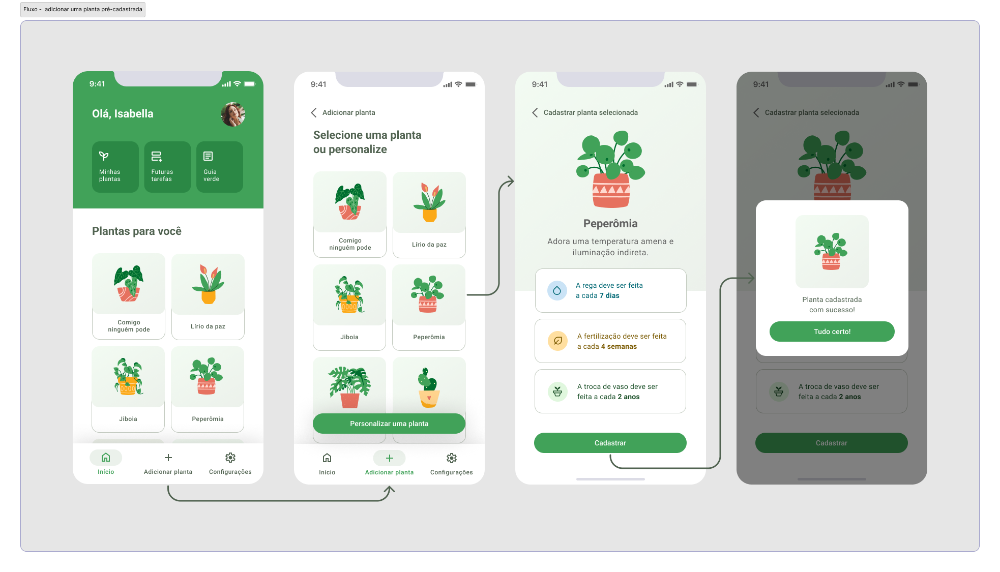 

#### 3. Adicionar uma Planta Personalizada:
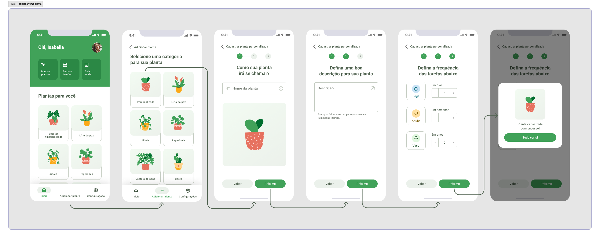 

#### 4. Editar Planta:
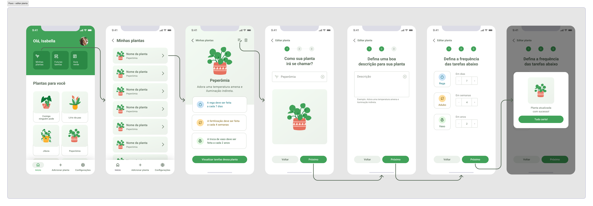 

#### 5. Visualizar Futuras Tarefas de uma Planta:
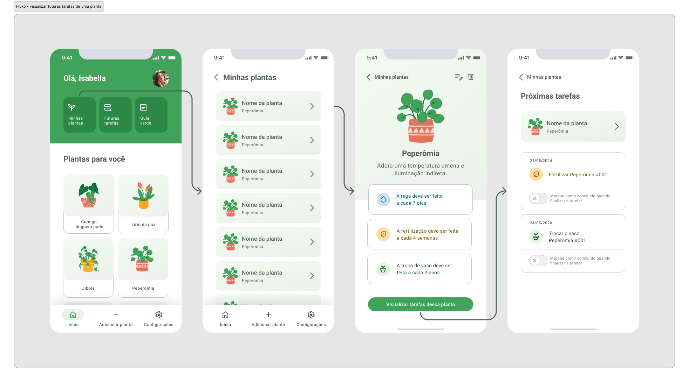 

#### 6. Excluir Plantas:
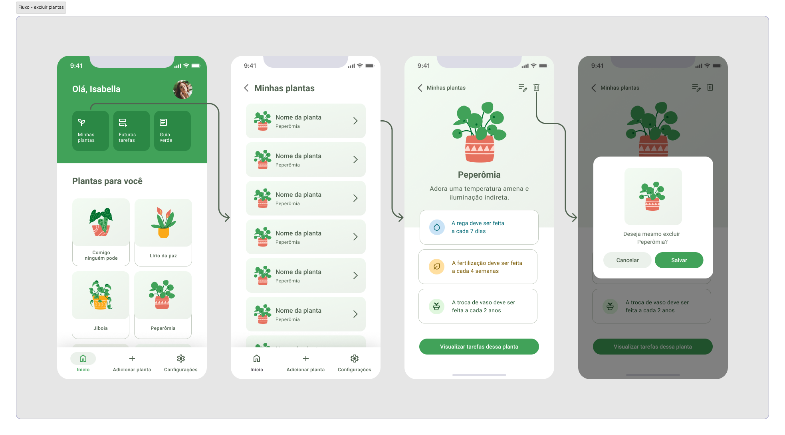 

#### 7. Futuras Tarefas:
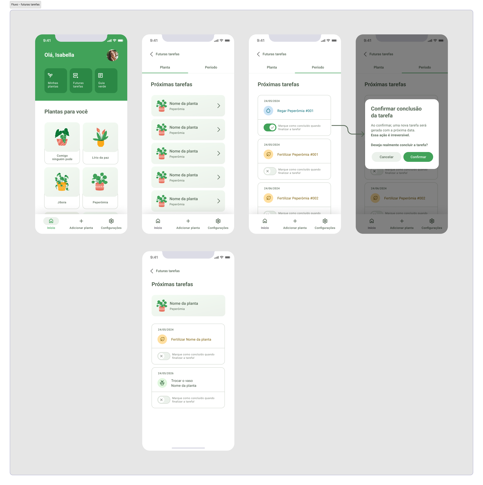 

#### 8. Configurações:
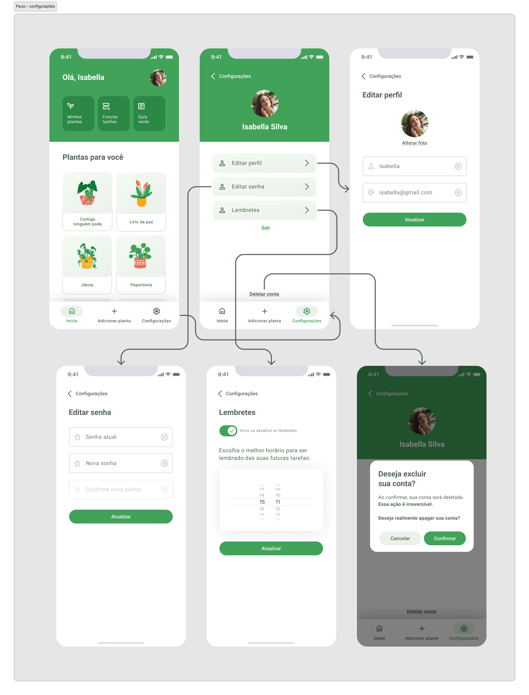 

#### 9. Acessar Artigos:
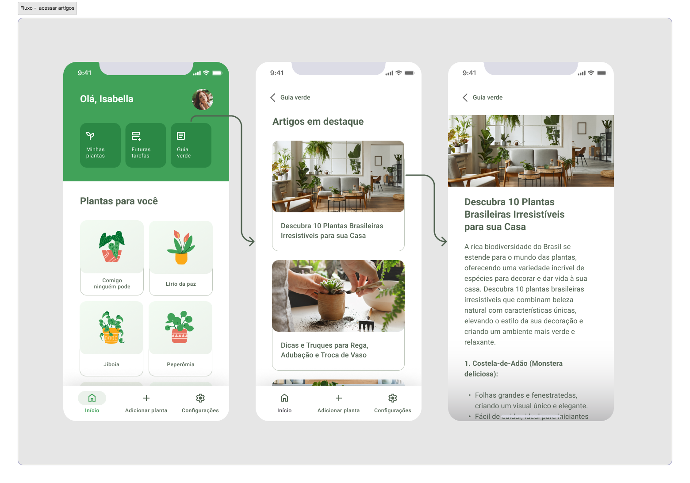

<!-- 
> **Links Úteis**:
> - [Protótipos vs Wireframes](https://www.nngroup.com/videos/prototypes-vs-wireframes-ux-projects/)
> - [Ferramentas de Wireframes](https://rockcontent.com/blog/wireframes/)
> - [MarvelApp](https://marvelapp.com/developers/documentation/tutorials/)
> - [Figma](https://www.figma.com/)
> - [Adobe XD](https://www.adobe.com/br/products/xd.html#scroll)
> - [Axure](https://www.axure.com/edu) (Licença Educacional)
> - [InvisionApp](https://www.invisionapp.com/) (Licença Educacional)
-->
