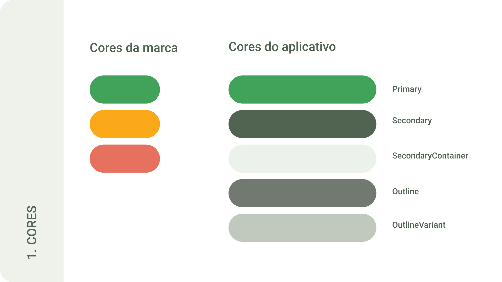
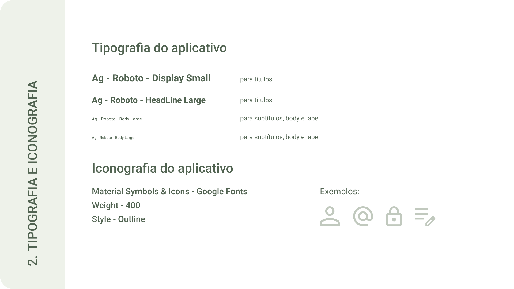
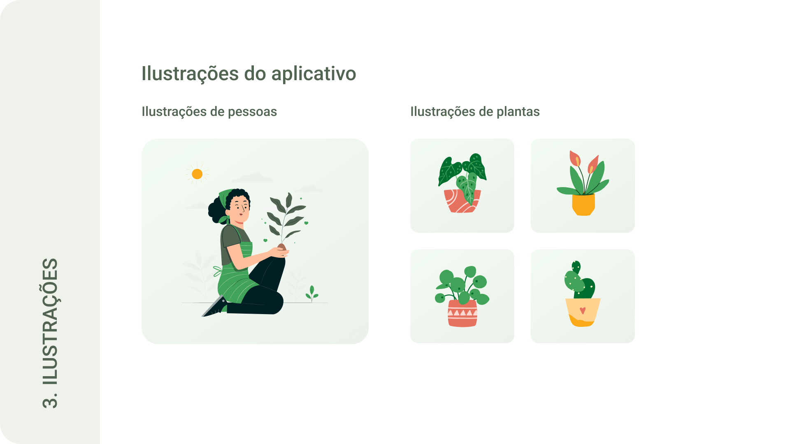

# Template Padrão da Aplicação

Layout padrão da aplicação que será utilizado em todas as páginas com a definição de identidade visual, tipografia, iconografia e ilustrações.
## Logo
O logotipo "Plantei" apresenta uma tipografia moderna e elegante, utilizando a fonte Nunito. A letra "P" destaca-se como o elemento principal do logotipo, assumindo a forma estilizada de uma folha verde. Essa representação visual evoca a natureza e o cuidado com as plantas.

## Cores

## Tipografia e iconografia

## Ilustração

## Template da aplicação
O template das telas da aplicação criadas até o momento contém os seguintes layouts:

> 1. Tela de Boas Vindas

Com foco nas funcionalidades do sistema, o presente documento expõe as telas desenvolvidas pelo grupo, juntamente com os requisitos atendidos e os artefatos da funcionalidade. O código fonte das telas pode ser consultada na página do projeto no GitHub ou [clicando aqui](https://github.com/ICEI-PUC-Minas-PMV-ADS/pmv-ads-2024-1-e3-proj-mov-t2-plantei/tree/main/src).

#### 1. Tela de Boas Vindas

<!--
> **Links Úteis**:
>
> - [CSS Website Layout (W3Schools)](https://www.w3schools.com/css/css_website_layout.asp)
> - [Website Page Layouts](http://www.cellbiol.com/bioinformatics_web_development/chapter-3-your-first-web-page-learning-html-and-css/website-page-layouts/)
> - [Perfect Liquid Layout](https://matthewjamestaylor.com/perfect-liquid-layouts)
> - [How and Why Icons Improve Your Web Design](https://usabilla.com/blog/how-and-why-icons-improve-you-web-design/)
-->
