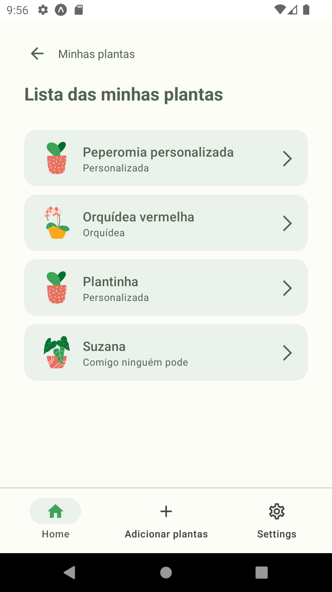
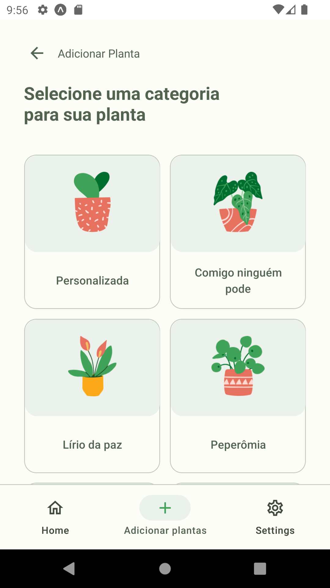
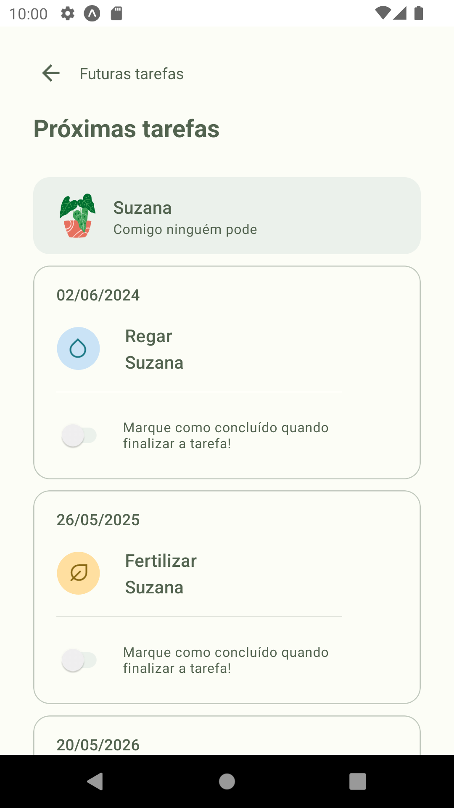

# Template Padrão da Aplicação

Layout padrão da aplicação que será utilizado em todas as páginas com a definição de identidade visual, tipografia, iconografia e ilustrações.
## Logo
O logotipo "Plantei" apresenta uma tipografia moderna e elegante, utilizando a fonte Nunito. A letra "P" destaca-se como o elemento principal do logotipo, assumindo a forma estilizada de uma folha verde. Essa representação visual evoca a natureza e o cuidado com as plantas.

## Cores

## Tipografia e iconografia

## Ilustração

## Template da aplicação
O template das telas da aplicação criadas até o momento contém os seguintes layouts:

> 2 Boas vindas
>
> 2.4 Home
>
> 4 Minhas plantas (com e sem plantas)
>
> 4.1.1 Cadastrar planta (parte 1 - selecionar categoria)
>
> 4.1.2 Cadastrar planta (parte 2 - escolher nome)
>
> 4.1.3 Cadastrar planta (parte 3 - escolher descrição)
>
> 4.1.4 Cadastrar planta (parte 4 - escolher frequência de tarefas)
>
> 4.1.5 Pop-up planta cadastrada 
>
> 4.2 Visualizar planta cadastrada
>
> 4.3 Visualizar tarefas da planta
>
> 4.4, 4.4.1 e 4.4.2 Editar planta
>
> 5 Futuras tarefas (sem tarefas)
>
> 5.1 Futuras tarefas - por planta
>
> 5.1.2 Futuras tarefas - por planta - detalhes
>
> 5.2 Futuras tarefas - por período
>
> 5.3 Pop-up confirmação de conclusão

Com foco nas funcionalidades do sistema, o presente documento expõe as telas desenvolvidas pelo grupo, juntamente com os requisitos atendidos e os artefatos da funcionalidade. O código fonte das telas e funcionalidades pode ser consultada na página do projeto no GitHub ou [clicando aqui](https://github.com/ICEI-PUC-Minas-PMV-ADS/pmv-ads-2024-1-e3-proj-mov-t2-plantei/tree/main/src).

#### 2. Tela de Boas Vindas

#### 2.4 Tela Home

#### 4 Minhas plantas (com e sem plantas)

### 4.1 Cadastrar planta (parte 1 - selecionar categoria)

### 4.1.2 Cadastrar planta (parte 2 - escolher nome)

### 4.1.3 Cadastrar planta (parte 3 - escolher descrição)

### 4.1.4 Cadastrar planta (parte 4 - escolher frequência de tarefas)

### 4.1.5 Pop-up planta cadastrada

### 4.2 Visualizar planta cadastrada

### 4.3 Visualizar tarefas da planta

### 4.4, 4.4.1 e 4.4.2 Editar planta
Telas correspondentes: a 4.1.2, 4.1.3 e 4.1.4, respectivamente.

### 5 Futuras tarefas (sem tarefas)

### 5.1 Futuras tarefas - por planta

### 5.1.2 Futuras tarefas - por planta - detalhes
Tela correspondente: 4.3

### 5.2 Futuras tarefas - por período

### 5.3 Pop-up confirmação de conclusão

<!--
> **Links Úteis**:
>
> - [CSS Website Layout (W3Schools)](https://www.w3schools.com/css/css_website_layout.asp)
> - [Website Page Layouts](http://www.cellbiol.com/bioinformatics_web_development/chapter-3-your-first-web-page-learning-html-and-css/website-page-layouts/)
> - [Perfect Liquid Layout](https://matthewjamestaylor.com/perfect-liquid-layouts)
> - [How and Why Icons Improve Your Web Design](https://usabilla.com/blog/how-and-why-icons-improve-you-web-design/)
-->
